<!-- .slide: data-background-image="img/cropped-instin_climax_00.jpg" -->
<!-- .slide: class="hover"-->

## Les institutions fantômes de la littérature numérique
&nbsp;

Nicolas Sauret  

 <!-- .element: class="logo" style="width:30%; background-color:ghostwhite;padding: 5px" -->

_Cartographie du web littéraire francophone_  
Université Lyon 3 - 22-24 janvier 2020

<!-- .element: style="font-size:1.4rem" -->

 <!-- .element: class="logo" -->

===

%%%%%%%%%%%%%%%%%%%%%%%%%%%%%%%%%%%%%%%%%%%%%
<!-- .slide: data-background-image="img/cropped-instin_climax_00.jpg" -->
<!-- .slide: class="hover"-->

## Sommaire

1. introduire la _Publishing Sphere_
2. intuition d'une synergie ou chronique d'un échec ?
3. _Instin Studies_ (rappel)
4. intersections
  - Diplomatie fantômnale
  - Ambassade des communs
  - Republier le monde

===

Dans cette présentation, je voudrais interroger la question de l'institution, telle que certaines communautés l'investissent, notamment des collectifs littéraires comme le Général Instin que nous avons étudié avec Servanne.

Car les cartographies du web littéraire sont manifestement des tentatives d'institutionnalisation de pratiques littéraires qui échappent encore à notre institution. Or ce web littéraire est peut-être lui-même en train d'inventer ses propres institutions.

Pour ce faire, je vais revenir sur l'évenement Publishing Sphere et le groupe de travail "Institutions fictionnelles", et son échec ?. Puis je reprendrais quelques conclusions de nos études instiniennes avec Servanne, pour mieux comprendre enfin les intersections qui auraient dû se faire dans mon groupe lors de la publishing sphere.

%%%%%%%%%%%%%%%%%%%%%%%%%%%%%%%%%%%%%%%%%%%%%

## Introduire  
## la Publishing Sphere

§§§§§§§§§§§§§§§§§§§§§§§§§§§§§§§§§§§§§§§§§§§§§
<!-- .slide: data-background-image="img/ps-tierslivre.png" data-background-size="contain" -->

<!-- 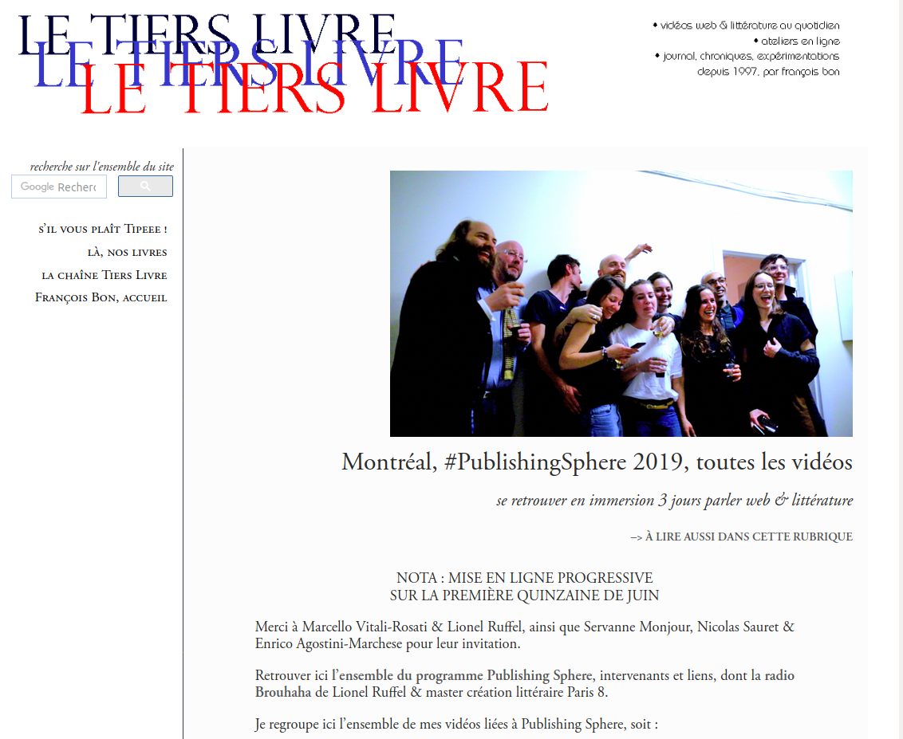 -->

===

je repars donc d'un évenement organisé à Montréal en mai 2019, intitulé _Publishing Sphere_. Prenant la suite d'une première édition initiée par Lionel Ruffel à Berlin l'été 2017, cette seconde édition était co-organisé par Lionel Ruffel, et l'équipe montréalaise de la chaire sur les écritures numériques, dirigée par Marcello Vitali-Rosati.

§§§§§§§§§§§§§§§§§§§§§§§§§§§§§§§§§§§§§§§§§§§§§
<!-- .slide: data-background-image="img/affichePSorga50.jpg" data-background-size="contain"-->

<!--  -->

===

Dans cette édition, nous avions voulu interroger l'édition et la publication en rassemblant un panel d'éditeurs, d'auteur, de chercheurs et d'artistes, qui, à defaut d'être représentatif d'un web littéraire, tissait des liens et jetait des passerelles entre des mondes éditoriaux divers.

L'enjeu de la PS, dans la lignée de la vision de Lionel Ruffel, était de déplacer le regard de la littérature, qu'elles qu'en soient les manifestations, pour s'intéresser aux processus qui la portent, l'affichent, l'éditent, la publient, etc.

§§§§§§§§§§§§§§§§§§§§§§§§§§§§§§§§§§§§§§§§§§§§§
<!-- .slide: data-background-image="img/pssite-programme.png" data-background-size="contain"-->

===

La Publishing Sphere avait l'ambition d'expérimenter des dispositifs d'écriture et d'édition, quelqu'en soit la forme.

Nous avions réparti la quarantaine de participants en 6 groupes de travail qui pendant trois jours ont planché pour proposer une ou plusieurs dispositifs et/ou production·s éditoriale·s, qu'elle soit poétique, littéraire, expérimentale, documentaire, ou autre.

<!-- Un des groupes de travail, le Shanzhai Lyrics, a ainsi performé une traduction poétique des inscriptions trouvées sur les vêtements contrefaits en Chine [photos]. -->

§§§§§§§§§§§§§§§§§§§§§§§§§§§§§§§§§§§§§§§§§§§§§
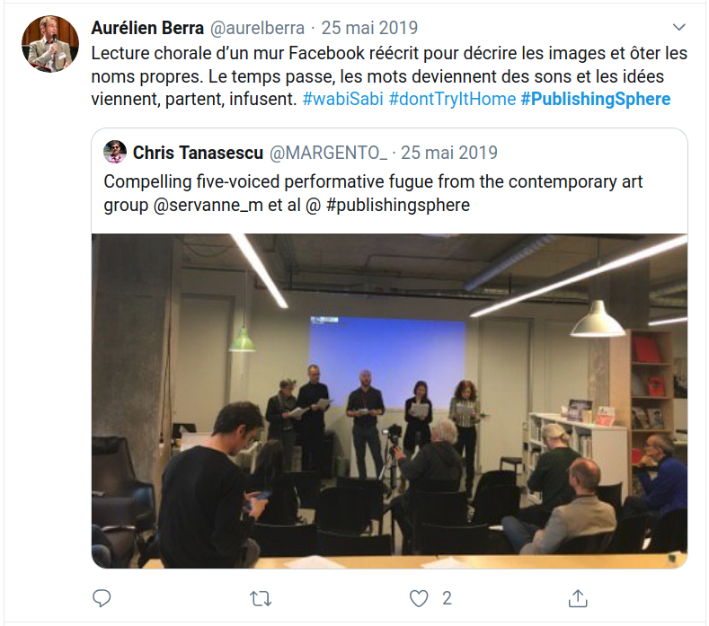
<!-- .element: style="width:48%;float:left" -->

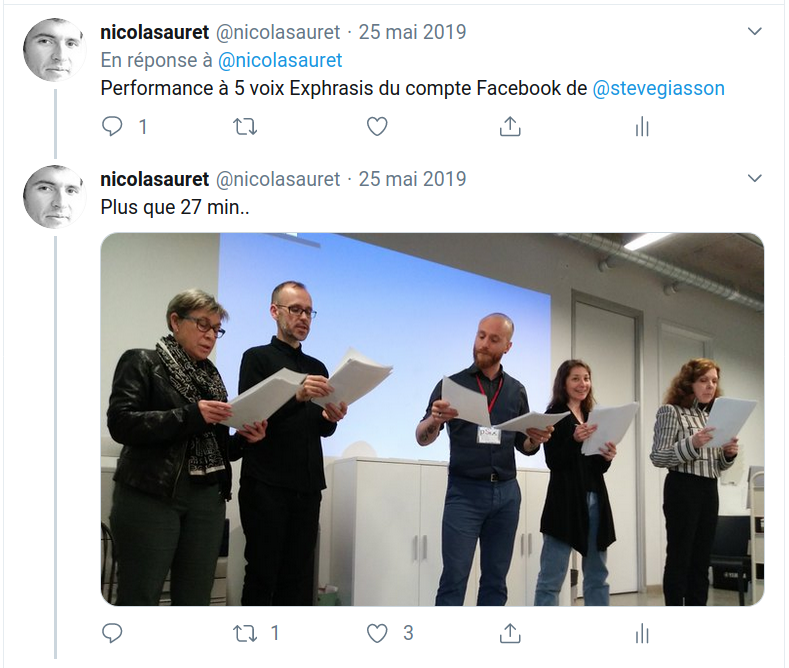
<!-- .element: style="width:48%" -->

===
À titre d'exemple, un des groupes de travail, mené par l'artiste Steve Giasson, s'est livré à l'exphrasis de sa page facebook, performance à 5 voix d'une trentaine de minutes.

§§§§§§§§§§§§§§§§§§§§§§§§§§§§§§§§§§§§§§§§§§§§§
<!-- .slide: data-background-image="img/ps-pinkmypad.png" data-background-size="cover"-->

> \> The Publishing Sphere emerges from writing in its broadest sense. For that very reason, it provides this Read/Write space that everyone can use to express, document, exchange, copy and paste, rewrite, remix and mashup.

<!-- .element: style="background-color:#222;font-size:0.8em;padding:2em" -->
<!-- .element class="fragment" data-fragment-index="2" -->

===
Dans l'esprit d'associer théorie et pratique, ou de faire naître la pensée par la pratique, nous avions proposé une plateforme d'écriture, de lecture et d'échange, elle-même un petit bijoux de bricolage, c'est-à-dire une techno aussi sale qu'efficace, aussi élégante qu'obscure, à la croisée de pratiques d'écritures émergentes (le pad d'écriture collaboratif) et d'une éditorialisation low-tech, et se voulant à la fois ouverte, transparente, appropriable.

En incipit, nous avions écrit :

> The Publishing Sphere emerges from writing in its broadest sense. For that very reason, it provides this Read/Write space that everyone can use to express, document, exchange, copy and paste, rewrite, remix and mashup.

§§§§§§§§§§§§§§§§§§§§§§§§§§§§§§§§§§§§§§§§§§§§§
<!-- .slide: data-background-image="img/ps-pmp-experimentaltranslation.png" data-background-size="cover"-->

<!-- 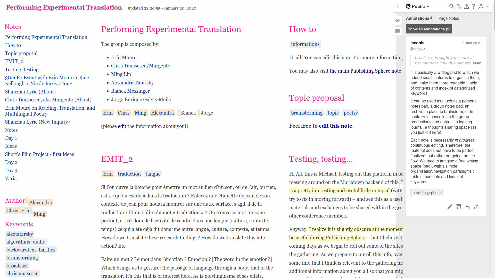 -->

===
Un espace d'écriture donc, très libre et très simple d'utilisation, que chaque groupe était invité à s'approprier, en se créant des pages, des notes, des pads d'écriture, automatiquement éditorialisés et associés à une interface d'annotation permettant ainsi une double production scripturale.

Cette plateforme (j'hésite à appeler ça une plateforme), c'était notre propre expérimentation au sein de la publishing sphere, une sorte de méta-sphere censée offrir un espace non pas centralisant, mais centrifuge, en espérant voir se développer le fameux rizhome.

[Voici ce que cela donne finalement en terme de réseau.]
[RESEAU de LIEN]

§§§§§§§§§§§§§§§§§§§§§§§§§§§§§§§§§§§§§§§§§§§§§
<!-- .slide: data-background-image="img/instin-puntaUnion.jpg" data-background-size="cover"-->

## Institutions fictionnelles

<!-- .element: style="margin-top:2.5em" -->

- **Patrick Chatelier** et **Eric Darsan** (Général Instin)
- **Sébatien Thiéry** (PEROU)
- **Camille Louis** (Kom.post)
- **Sylvia Fredriksson** (Ambassade des communs de WOS/Agence des hypothèses)

<!-- .element: style="background-color:#222;font-size:0.8em;padding:1em 2em" -->
<!-- .element class="fragment" data-fragment-index="2" -->

Image : Siège officiel de l’institution fictionnelle en hommage au PEROU  
\#GI #Patrick #traitdunion

<!-- .element: style="background-color:#222;font-size:0.7em;margin-top:4em" -->

===
Le groupe auquel j'ai participé s'intitulait Institutions fictionnelles. Il était initié par Sylvia Fredriksson, designeuse très engagée dans le mouvement des communs en France.

le groupe rassemblait deux membres du Général Instin, Eric Darsan et Patrick Chatelier, ce dernier, éditeur de la plateforme de création littéraire Remue.net, a été et reste encore la figure la plus engagée dans le collectif Instin.

Sebastien Thiéry, enseignant à École Nationale Supérieure d’Architecture de Paris Malaquais et fondateur du PEROU, le _Pôle d’Exploration des Ressources Urbaines_. Le PEROU est un groupe d'action développant «des recherches-actions sur les confins de nos villes (bidonvilles, jungles, squats, refuges en tout genre) et les gestes, formes, actes d’hospitalité qui s’y inventent». Le PEROU a par exemple échaffaudé au cœur de la jungle de Calais divers institutions comme le Palais, dédié à Yvette, l'ambassade du PEROU, dédié à l'hospitalité, Il y publie de faux journaux, et procède à un "relevé des actes d'hostpitalité". Toutes ces actions et inscriptions sont pour Sebastien Thiery des REQUALIFICATION et des REPUBLICATIONS. Les bidonvilles sont des écritures qui légifèrent en silence. Le PEROU enquête, collecte, procède à des relevés, et produit à son tour des écritures dissidentes (aux écritures assassines de l'ETAT).

Camille Louis est artiste dramaturge et co-initiatrice du collectif KOM.POST travaillant sur [...]. Son travail se situe au croisement de l'art et de la politique. Elle a notamment produit l'édition _la Jungle et la ville_, sur Médiapart.

Sylvia Fredriksson enfin, travaillait depuis quelques mois aux côté de Claire Dehove sur ce projet intitulé Ambassade des communs, initié en 2014 par WOS / Agence des Hypothèses dans le cadre du programme Nouveaux Commanditaires, programme de financement de la ville de Bordeaux de type projet participatif. L'agence des hypothèses porte une politique des usages conduisant à des dispositifs matérialisés – architectures utopiques, campements, zones de gratuité instituées ou sauvages.
L'ambassade des communs se pense comme une institution fictive, installée physiquement dans un hall de la maison des arts de Bordeaux Montaigne. Le projet cherchait à revitaliser un lieu en mobilisant les désirs et autres modalités d’appropriation d’un groupe, en créant les conditions de la convivialité et du partage du lieu dans les meilleures conditions possibles.

§§§§§§§§§§§§§§§§§§§§§§§§§§§§§§§§§§§§§§§§§§§§§
<!-- .slide: data-background-image="img/ps-pmp-institutionsfictionnelles.png" data-background-size="cover"-->

> \> À l’origine de ce groupe, une intuition, portée par les organisateurs de Publishing Sphere, que nous (Camille, Général Instin, Éric, Érik, Nathalie, Patrick, Sébastien, Sylvia) pouvions nous réunir pour nous saisir des enjeux qui touchent aux “communs” et aux “configurations urbaines dans les marges”.

<!-- .element: style="background-color:#222;font-size:0.8em;padding:2em" -->
<!-- .element class="fragment" data-fragment-index="2" -->

Source : Note d'intention (Sylvia)  
http://notes.ecrituresnumeriques.ca/qRg-hdGxS9e7sF9Fo3eSSQ.html

<!-- .element: style="background-color:#222;font-size:0.7em;" -->
<!-- .element class="fragment" data-fragment-index="2" -->

===

Publiée sur le mur du groupe, la note d'intention produite par Sylvia précise :

> À l’origine de ce groupe, une intuition, portée par les organisateurs de Publishing Sphere, que nous (Camille, Général Instin, Éric, Érik, Nathalie, Patrick, Sébastien, Sylvia) pouvions nous réunir pour nous saisir des enjeux qui touchent aux “communs” et aux “configurations urbaines dans les marges”.

Toutes ces initiatives, tous ces projets constituaient des horizons de pratiques et de pensées qui nous laissaient présager une rencontre extrêmement porteuse et productive, tant chacun semblait rompu à l'accueil, au partage et une sensibilité au collectif, que ce soit dans les processus ou dans les finalités produites.

§§§§§§§§§§§§§§§§§§§§§§§§§§§§§§§§§§§§§§§§§§§§§

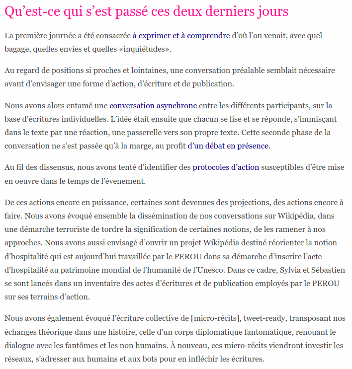

<!-- .element style="font-size:1em;width:40%;float:left;margin:3em 1em 0 0" -->

> \> Au regard de positions si proches et lointaines, une conversation préalable semblait nécessaire avant d’envisager une forme d’action, d’écriture et de publication.
>
> [...]
>
> \> Cette seconde phase de la conversation [annnotation mutuelle] ne s’est passée qu’à la marge, au profit d’un débat en présence.
>
> \> Au fil des dissensus, nous avons tenté d’identifier des protocoles d’action susceptibles d’être mise en œuvre dans le temps de l’évenement.

<!-- .element style="font-size:0.7em;width:50%;float:left" -->

Source : Notes du 25 mai - Qu'est ce qui s'est passé ces deux derniers jours  
http://notes.ecrituresnumeriques.ca/bJ1f1lNVQn-YinY6x-3GrQ.html

<!-- .element style="font-size:0.7em" -->

===

Et pourtant, dans ce groupe précisemment, rien ne s'est passé comme prévu. En pratique, nous avons passé trois jours à discuter sans réussir à faire émerger le moindre consensus d'action collective entre les participants. Voyant les différentes impasses dans lesquelles le groupe s'embourbait, nous avons tenté de mettre en place plusieurs dispositifs d'échange et de conversation, conversation synchrone et conversation asynchrone.

Pour ma part, rompu à différentes expériences de collaboration, sur des projets très court terme, comme des hackathon de quelques jours, ou plus long terme, Je me suis retrouvé dans un groupe incapable de se parler, malgré les efforts des uns et des autres. Un peu desépéré, je rédigeais à la fin de la seconde journée une note intitulée «Qu'est ce qui s'est passé ces deux derniers jours» :

> Au regard de positions si proches et lointaines, une conversation préalable semblait nécessaire avant d’envisager une forme d’action, d’écriture et de publication.
>
> [...]
>
> Cette seconde phase de la conversation [annnotation mutuelle] ne s’est passée qu’à la marge, au profit d’un débat en présence.
>
> Au fil des dissensus, nous avons tenté d’identifier des protocoles d’action susceptibles d’être mise en œuvre dans le temps de l’évenement.

Rien de collectif n'est véritablement sorti de notre groupe de travail.

J'essaie aujourd'hui de comprendre ce qui a échoué ? De quoi cet échec (très relatif, nous le verrons en conclusion) est il le symptome ? Est ce l'échec du méta dispositif de la Publishing Sphere, ces trois jours d'ateliers en groupe ? Est ce l'échec de personnalités irréconciliable ? Et finalement, est-ce vraiment un échec ?

§§§§§§§§§§§§§§§§§§§§§§§§§§§§§§§§§§§§§§§§§§§§§

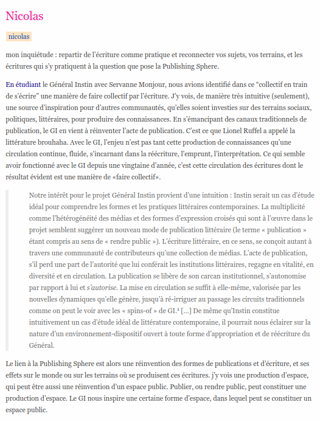

<!-- .element style="font-size:1em;width:40%;float:left;margin:0 1em 0 0" -->

> \> En étudiant le Général Instin avec Servanne Monjour, nous avions identifié dans ce “collectif en train de s’écrire” une manière de faire collectif par l’écriture.
>
> [...]
>
> \> Le lien à la Publishing Sphere est alors une réinvention des formes de publications et d’écriture, et ses effets sur le monde ou sur les terrains où se produisent ces écritures. j’y vois une production d’espace, qui peut être aussi une réinvention d’un espace public. Publier, ou rendre public, peut constituer une production d’espace. Le GI nous inspire une certaine forme d’espace, dans lequel peut se constituer un espace public.

<!-- .element style="font-size:0.6em;width:50%;float:left" -->

Source : Notes du 24 mai - temps d'écriture individuel   
http://notes.ecrituresnumeriques.ca/1jSmmzxnQ5i8RTc8Bl2oIQ.html#nicolas

<!-- .element style="font-size:0.7em" -->

===
Pourtant, on y voyait assez clair avec Sylvia en composant le groupe : Dans une tentative de clarification, partagée sur le pad du groupe, j'écrivais :

> En étudiant le Général Instin avec Servanne Monjour, nous avions identifié dans ce “collectif en train de s’écrire” une manière de faire collectif par l’écriture. J’y vois, de manière très intuitive (seulement), une source d’inspiration pour d’autres communautés, qu’elles soient investies sur des terrains sociaux, politiques, littéraires, pour produire des connaissances. En s’émancipant des canaux traditionnels de publication, le GI en vient à réinventer l’acte de publication. C’est ce que Lionel Ruffel a appelé la littérature brouhaha. Avec le GI, l’enjeu n’est pas tant cette production de connaissances qu’une circulation continue, fluide, s’incarnant dans la réécriture, l’emprunt, l’interprétation. Ce qui semble avoir fonctionné avec le GI depuis une vingtaine d’année, c’est cette circulation des écritures dont le résultat évident est une manière de «faire collectif».

> Le lien à la Publishing Sphere est alors une réinvention des formes de publications et d’écriture, et ses effets sur le monde ou sur les terrains où se produisent ces écritures. j’y vois une production d’espace, qui peut être aussi une réinvention d’un espace public. Publier, ou rendre public, peut constituer une production d’espace. Le GI nous inspire une certaine forme d’espace, dans lequel peut se constituer un espace public. [source: http://notes.ecrituresnumeriques.ca/1jSmmzxnQ5i8RTc8Bl2oIQ.html#nicolas]

Alors pour comprendre cette intuition, il est nécessaire de revenir en arrière. je vous propose donc de replonger dans l'analyse qu'on faisait du GI deux ans plus tôt.

---

>  >  Notre intérêt pour le projet Général Instin provient d’une intuition : Instin serait un cas d’étude idéal pour comprendre les formes et les pratiques littéraires contemporaines. La multiplicité comme l’hétérogénéité des médias et des formes d’expression croisés qui sont à l’œuvre dans le projet semblent suggérer un nouveau mode de publication littéraire (le terme « publication » étant compris au sens de « rendre public »). L’écriture littéraire, en ce sens, se conçoit autant à travers une communauté de contributeurs qu’une collection de médias. L’acte de publication, s’il perd une part de l’autorité que lui conférait les institutions littéraires, regagne en vitalité, en diversité et en circulation. La publication se libère de son carcan institutionnel, s’autonomise par rapport à lui et s’autorise. La mise en circulation se suffit à elle-même, valorisée par les nouvelles dynamiques qu’elle génère, jusqu’à ré-irriguer au passage les circuits traditionnels comme on peut le voir avec les « spins-of » de GI.1 […] De même qu’Instin constitue intuitivement un cas d’étude idéal de littérature contemporaine, il pourrait nous éclairer sur la nature d’un environnement-dispositif ouvert à toute forme d’appropriation et de réécriture du Général. (http://nicolassauret.net/behindinstin/2017/04/11/questions-de-recherche.html)

%%%%%%%%%%%%%%%%%%%%%%%%%%%%%%%%%%%%%%%%%%%%%
<!-- .slide: data-background-image="img/1-12.jpg" data-background-size="contain" -->

### INSTIN

<!-- .element: style="width:45%; float:left; display:in-line-block" -->

### INSTIN STUDIES

<!-- .element: style="width:45%; float:left; display:in-line-block; margin-left:10%" -->

source image: _Un homme parle –Autopsie de l’esprit_ sur remue.net

<!-- .element: class="source" -->

===
Je raccroche ici les wagons avec ce que Servanne vous a présenté ce matin, en vous présentant ce qu'on avait appelé les instin studies, dans une tentative, vaine sans doute, de bien se démarquer du corpus instin lui-même.

En adoptant l'éditorialisation comme méthodologie littéraire, nous cherchions nous même à structurer un espace pour comprendre la structuration de l'espace Instin. Approche réflexive sur notre archive en gestation, pour faire dialoguer le dispositif de publication littéraire du GI, et le dispositif d'une archive scientifique.

§§§§§§§§§§§§§§§§§§§§§§§§§§§§§§§§§§§§§§§§§§§§§

<!-- .slide: data-background-image="img/campagneNonOfficielle.png" -->
<!-- .slide: class="hover"-->

### Général Anarchie ?

> «Il n’y a pas de chef, pas d’organisation, c’est un fonctionnement particulier. Il n’y a jamais eu non plus de comité de rédaction. Ni de réunion. Une tentative de séminaire a capoté. Il y a des opportunités et des gens qui vont s’investir, longtemps ou pas, dans cette entité.»
>
> Patrick Chatelier  

<!-- .element: style="font-size:1.7rem; text-align:justify" -->

source image: _Général Instin_ sur facebook.com

<!-- .element: class="source" -->

===

Mais alors quel est cet espace Instin ? Quel est le dispositif d'écriture, de publication et d'éditorialisation qui régit l'agencement d'un tel corpus indéfinissable, multi-forme, presque insaisissable, comme la photo originelle du vitrail ?
Quelles seraient les structures d'autorité d'un tel projet ?

Les instigateurs du projet aiment à le rappeler (presque comme un discours d'accompagnement):

> «Il n’y a pas de chef, pas d’organisation, c’est un fonctionnement particulier. Il n’y a jamais eu non plus de comité de rédaction. Ni de réunion. Une tentative de séminaire a capoté. Il y a des opportunités et des gens qui vont s’investir, longtemps ou pas, dans cette entité.»

Manifestement, le Général Instin, en tant que production collective au long cours, semble échapper à toute structure et à toute contrainte. La diversité de nature de ses multiples manifestations confirme une absence de forme éditoriale, caractéristique justement du projet, et cela dessine en creux une absence de dispositif.

Mais alors quel ressort a permis au GI d'être si productif pendant une vingtaine d'années ?

§§§§§§§§§§§§§§§§§§§§§§§§§§§§§§§§§§§§§§§§§§§§§

<!-- .slide: data-background-image="img/affiche8bis.jpg" data-background-size="contain" -->
<!-- .slide: class="hover"-->

<blockquote class="twitter-tweet" data-lang="fr">
sortir radicalement des règles momifiées de l&#39;édition bourgeoise, le manifester, s&#39;installer ailleurs
&mdash; françois bon (@fbon) 28 mars 2012</blockquote>

source image: _rue instin_ sur Remue.net

<!-- .element: class="source" -->

===

Dans son étude sur les réseaux d'écrivains, Valérie Beaudouin cite ce tweet de François Bon qui rend bien compte de la position adoptée et assumée par ce qu'elle appelle les «réseaux d'écrivains».

> sortir radicalement des règles momifiées de l’édition bourgeoise, le manifester, s’installer ailleurs
    6:52 PM - 28 Mar 12

Beaudouin, V. (2012). Trajectoires et réseau des écrivains sur le Web: Construction de la notoriété et du marché. Réseaux, 175,(5), 107-144. doi:10.3917/res.175.0107. -->

§§§§§§§§§§§§§§§§§§§§§§§§§§§§§§§§§§§§§§§§§§§§§
<!-- .slide: data-background-image="img/10458166_10153074634228797_4994304635406227180_n.jpg" -->
<!-- .slide: class="hover"-->

### Une littérature "brouhaha"

> « Publier » retourne à son sens originel : rendre public, passer de l’expression privée destinée à des correspondants précis à l’expression pour des publics de plus en plus divers.
>
> Lionel Ruffel, _Brouhaha, Les Mondes du contemporain_

<!-- .element: style="font-size:0.8em; text-align:justify" -->

===

Lionel Ruffel a proposé le terme de "littérature brouhaha" pour qualifier ce passage d'un imaginaire du littéraire centré sur le livre comme objet-support, à un imaginaire du littéraire centré sur une action et une pratique : la publication.
[CITER]

L'idée n'est pas de dire que GI est "nouveau" et révolutionne la littérature sous l'effet du numérique.
Au contraire, on a un retour à une certaine conception de la littérature.
Dans ses travaux sur l'oralité, Zumthor avait bien montré que le passage vers une culture de l'écrit avait marqué le début d'une distance que l’homme prenait envers lui-même, son éloignement de son propre corps: "Un art qui reposait sur des techniques d’assemblage, de combinaison, de collage, sans souci d’authentification des parties, recule et cède assez vite le terrain à un art nouveau, qu’anime une volonté de singularisation. La théâtralité généralisée de la vie publique commence à s’estomper, et l’espace se privatise."

C'est justement contre cette privatisation que semble œuvrer Instin, en renouant avec la poésie au sens étymologique (un _faire_).

§§§§§§§§§§§§§§§§§§§§§§§§§§§§§§§§§§§§§§§§§§§§§
<!-- .slide: data-background-image="img/sp38.png" -->
<!-- .slide: class="hover"-->

### Gestes de publication

>«L’écriture numérique s’offre également comme un ciel ouvert, un chantier, une progression ininterrompue et non téléologique, un dialogue constant et tendu avec les formes. En s’offrant comme milieu, comme écosystème, l’expérience directe du processus de l’écriture s’intensifie.»
>
> Sébastien Rongier, _Le_ Général Instin, _les vies multiples du littéraire_

<!-- .element: style="font-size:1.4rem; text-align:justify" -->

source image: _STREET-ART CAMPAGNE INSTIN_ sur sp38.com

<!-- .element: class="source" -->

===

Ce que l'on qualifiera donc désormais de "gestes de publication" traduit une conception de l'écriture comme "milieu", pour reprendre l'expression de Sébastien Rongier qui a consacré des travaux au Général Instin.
CITER

Cette écriture-milieu nous semble un fait particulièrement intéressant parce qu'il nous permet de revisiter la notion de dispositif en l'émancipant de son caractère déterministe.

§§§§§§§§§§§§§§§§§§§§§§§§§§§§§§§§§§§§§§§§§§§§§

<!-- .slide: data-background-image="img/rubon622.jpg"  -->
<!-- .slide: class="hover"-->

### «dispositive» _(adj.)_

* _action dispositive_ (Merzeau, 2013)
* _écritures dispositives_ : objet et milieu

===

Pour qualifier les échanges en ligne d'une communauté lors d'un colloque en 2012,
Louise Merzeau propose le terme d'_action dispositive_, introduisant l'idée d'une action à la fois opérée dans la cadre d'un dispositif mais aussi contributive et constitutive du dispositif.

En 2016, elle parle encore de _rhétorique dispositive_, cette forme de discours et cette capacité de nous écrire, cad de nous écrire collectivement, dans l'environnement numérique (= écriture, soit environnement-dispositif).

Ainsi, en glissant du concept à l'adjectif, nous abandonnons le _dispositif_, notion potentiellement problématique, mais sans en abandonner la fonction, ce qui nous semble particulièrement pertinent et opérant pour embrasser la nature environnementale du numérique.

De fait, il n’y a pas de dispositif formel Général Instin, mais Instin produit un environnement, un environnement-_dispositif_ dans lequel les actions sont des _écritures dispositives_, autrement dit, des écritures _dans_ le milieu et _du_ milieu.

Ce milieu, concept lui aussi problématique tant il est traversé par différents courants (les media studies, l’intermédialité ou même la médiologie), reste pertinent à nouveau par sa fonction :  nous obligeant notamment à « remplace[r] l’entité par la relation », comme le dit Régis Debray, dans une démarche similaire à l’intermédialité. Le milieu nous incite à déplacer notre attention de chercheur, de l’œuvre littéraire elle-même vers l'écriture en tant que processus, cad comme un mouvement dynamique fait de réécritures successives.

Le milieu n'est pas un simple présent à observer, mais la somme d’une histoire à prendre en compte.

§§§§§§§§§§§§§§§§§§§§§§§§§§§§§§§§§§§§§§§§§§§§§
<!-- .slide: data-background-image="img/joachimsene_hinspirefort.png" data-background-size="cover" -->
<!-- .slide: class="hover"-->

## Écriture.s

&nbsp;

- récursivité
- valeurs
- remix
- appropriation

ce qui change: le paradigme devient environnemental

source image: code source JS de _Hinspire fort, de Joachim Séné_ sur sp38.com

<!-- .element: class="source" -->

===

Victor Petit et Serge Bouchardon nous enseignent que l'écriture numérique se joue sur trois niveaux : l'écriture avec les machines (l'usage), l'écriture pour les machines (le code) et l'écriture par les machines (le niveau binaire). D'une couche d'abstraction à une autre jusqu'au plus petit dénominateur commun du milieu numérique à savoir le code binaire, chacune de ces écritures, opèrent sur les autres, tout en étant opérées par les autres.

Preuve de l'imbrication de l'écriture à son milieu, le collectif GI fonctionne sur les mêmes valeurs avec lesquelles les protocoles du net et du web ont été _écrits_, à savoir l'ouverture, la transparence et la décentralisation.

Cette récursivité n'est pas un hasard, elle a été largement théorisée pour décrire le lien entre support et pensée, par exemple à travers la notion de causalité formelle, récursive ou circulaire, selon les penseurs.

Et puisque le numérique est un milieu d'écritures (dans ses codes, ses protocoles, ses dispositifs), il intègre lui-aussi de manière récursive des valeurs qui se reproduisent dans les écritures qu'il supporte.

Qu'on la retrouve à tous les niveaux d'écritures, que ce soit dans les licences open-source qui organisent le copy-left et le protège contre les enclosures, ou dans les pratiques littéraires qui organisent l'appropriation, cela montre bien que ce paradigme peut investir toutes les sphères de la culture humaine.

Ce n'est pas le paradigme qui est nouveau, c'est le fait qu'il soit environnemental, c'est le fait que nous écrivons dans un milieu qui prédispose la circulation et l'appropriation, tous deux vecteurs de la dynamique de réécriture.

§§§§§§§§§§§§§§§§§§§§§§§§§§§§§§§§§§§§§§§§§§§§§
<!-- .slide: data-background-image="img/PostIt.jpg" -->
<!-- .slide: class="hover"-->

## Modèle conversationnel

&nbsp;

Renouveler les processus de production du sens :

- imaginaire
- mémoire
- interprétation

===

Instin est emblématique de ce paysage. Ce jeu décomplexé de l'emprunt, du remix, du mashup, voir du plagiat, mais aussi ce jeu de rebond d'un hypertexte à un autre, ou encore l'oralité et la performance réhabilitant la présence et l'échange, témoignent ensemble du modèle conversationnel.

Et puisque son écriture est autant récit que milieu, ce n'est pas simplement la figure littéraire du général qui est ouverte, transparente et appropriable, ce sont également ses principes, son fonctionnement, son milieu-dispositif.

On retrouve ainsi cette même dynamique de réécriture et d'appropriation dans le dispositif décrit par Louise Merzeau en 2013, dont l'objet cette fois-çi n'était pas littéraire, mais scientifique et philosophique. Dans cet article, Louise Merzeau montre qu'un dispositif conversationnel est susceptible de produire des connaissances (une mémoire), de la même manière que le GI génère une production littéraire (un imaginaire).

Dans ces réseaux d'échange, ces «réseaux d'intelligence», qu'ils soient éphémères ou au long cours, l'enjeu n'est pas tant de stabiliser les idées ou de fixer les textes, mais de les faire circuler, de constamment les réitérer, à travers des pratiques d'écritures qui sont peut-être avant tout des gestes d'édition et de publication, autrement dit des éditorialisations.

En implémentant l'écriture comme mouvement dynamique, les pratiques conversationnelles sont une piste à explorer pour renouveler les processus de fabrication du sens que sont la mémoire, l'imaginaire, et l'interprétation, qui d'après Derrida vont toujours ensemble.

§§§§§§§§§§§§§§§§§§§§§§§§§§§§§§§§§§§§§§§§§§§§§
<!-- .slide: data-background-image="img/lundimatin_instin.png" data-background-size="contain" -->

## «GI Commons»

source image: _Général Instin_ sur facebook.com

<!-- .element: class="source" -->

===
Tout cela nous incite à penser que la valeur de cette littérature n'est plus à rechercher entièrement dans sa littérarité, mais dans ce qu'elle explore en terme d'espace public, de collectif, ...de commun aussi.

%%%%%%%%%%%%%%%%%%%%%%%%%%%%%%%%%%%%%%%%%%%%%

# «Paradigme !»

===

C'est en quelque sorte ce que nous poursuivions en mai dernier lors de la Publishing SPhere, dans notre groupe sur l'institution fictionnelle, mais sans jamais vraiment l'attraper.

Car ce que le GI nous apprend c'est que le processus d'institutionnalisation est ailleurs, et surtout **est autre**. Il ne repose plus sur les structures traditionnelles de l'institution, il se fait par l'écriture certes, mais dans une perpétuelle réécriture des structures institutionnelles, autrement dit dans un processus continue, dont la finalité n'est plus l'institution, mais le _faire collectif_..

Instin performe ainsi un autre mode d'existence de l'institution. Cette proposition institutionnelle alternative était effectivement le point de départ de chacun des participants au groupe.

§§§§§§§§§§§§§§§§§§§§§§§§§§§§§§§§§§§§§§§§§§§§§

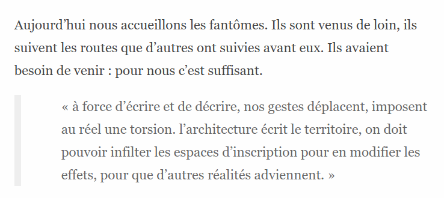

<!-- .element style="width:65%; float:left" -->

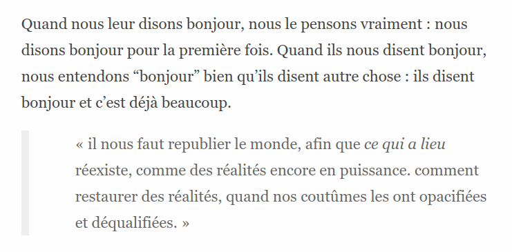

<!-- .element style="width:65%;float:left;margin-top:-1em" -->

Source : Micro-récits d’une diplomatie fantômnale (Patrick Chatelier)

<!-- .element style="margin-top:2em;font-size:0.8em" -->

===
Patrick intervient 2 fois, une fois en jouant le jeu de la présentation du groupe à la fin des trois jours d'atelier. Son écriture témoigne d'un effort certain pour intégrer les différents éléments apportés par chaque participant du groupe. Dans cette première performance, il propose le récit d'une diplomatie fantomatique où se rencontrent une délégation d'humain avec celle des fantômes, supposée établir un dialogue entre humains et non-humains. M'intercalant dans cette performance, j'avais inscrit dans ce récit une série de fausses citations issues des vraies conversations du groupe. La prise de note initiale servant de matériau pour réécrire une série d'aphorismes et de maximes qui teintent le premier récit d'injonctions reformulées de manière dramatique.

§§§§§§§§§§§§§§§§§§§§§§§§§§§§§§§§§§§§§§§§§§§§§

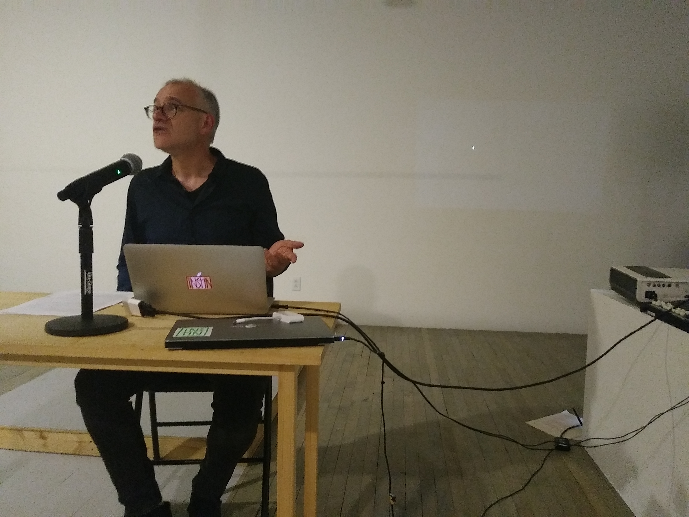

<!-- .element style="width:40%;float:left" -->

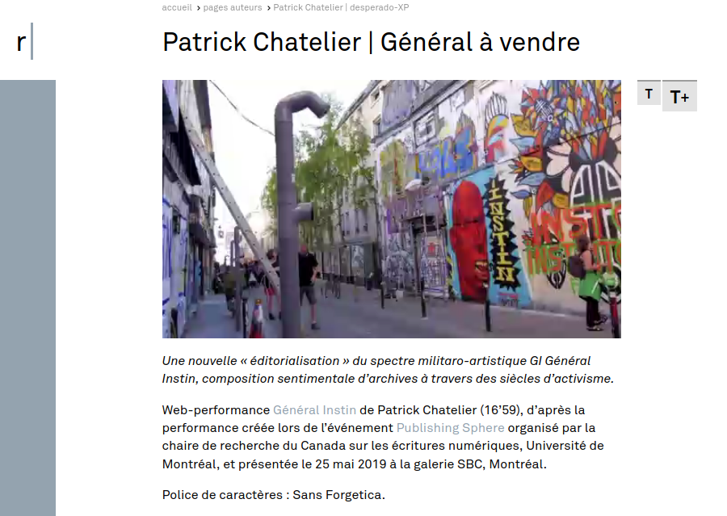

<!-- .element style="width:58%;float:left" -->

&nbsp;

_Une nouvelle « éditorialisation » du spectre militaro-artistique GI Général Instin, composition sentimentale d’archives à travers des siècles d’activisme_

<!-- .element style="font-size:0.8em" -->

===

Une seconde fois dans une performance solo, intitulée «Général à vendre» [Photo performance], et dont un enregistrement est disponible sur Remue.net, avec la légende suivante "Une nouvelle « éditorialisation » du spectre militaro-artistique GI Général Instin, composition sentimentale d’archives à travers des siècles d’activisme.".

§§§§§§§§§§§§§§§§§§§§§§§§§§§§§§§§§§§§§§§§§§§§§

> GI fut résumé ainsi : prendre acte, faire geste&nbsp;; prendre acte des gestes faits, faire geste des actes pris. Dans une perpétuelle revenance entre moi et nous, intime-extime, réel-fiction, marge-centre.

<!-- .element style="font-size:0.8em;padding:1em" -->

&nbsp;

Source : _Général à vendre_  
https://remue.net/patrick-chatelier-general-a-vendre

<!-- .element style="font-size:0.8em" -->

===
Dans ce texte, Patrick Chatelier retrace l'histoire du GI et du collectif Instin, construisant son propos sur une série d'images et de son. En empruntant un texte plus ancien, il déclare :

> GI fut résumé ainsi : prendre acte, faire geste&nbsp;; prendre acte des gestes faits, faire geste des actes pris. Dans une perpetuelle revenance entre moi et nous, intime-extime, réel-fiction, marge-centre.

§§§§§§§§§§§§§§§§§§§§§§§§§§§§§§§§§§§§§§§§§§§§§

> le GI se veut potentiellement partout. Reconfiguré, recyclé, détourné. Mégalomanie décalcomaniaque. Sans pourtant être démiurge, créateur, auteur, plutôt assembleur.

<!-- .element style="font-size:0.8em;padding:1em" -->

&nbsp;

Source : _Général à vendre_  
https://remue.net/patrick-chatelier-general-a-vendre

<!-- .element style="font-size:0.8em" -->

===

Il invente un terme pour l'occasion, le mot _instiner_, qui semble vouloir désigner l'acte d'éditer, de faire geste d'écriture et d'édition. On comprend dans ce terme que les _instiniens_ sont en fait des _instineurs_. Ils n'appartiennent pas à une communauté, il la font.

§§§§§§§§§§§§§§§§§§§§§§§§§§§§§§§§§§§§§§§§§§§§§

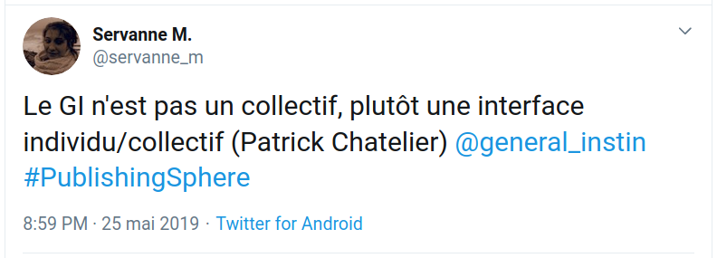

===

Son interprétation du GI est très clair. Le GI n'est pas un collectif, c'est une interface entre les individus qui s'en emparent et le collectif. La finalité du GI est donc bien selon ses termes de «faire collectif». Le GI est alors ce mouvement, «mouvement de collectivité des individus» comme il l'appelle.

§§§§§§§§§§§§§§§§§§§§§§§§§§§§§§§§§§§§§§§§§§§§§

> Les œuvres collectives, collaboratives ou plurielles sont entourées d’un flou juridique mais aussi conceptuel.
>
> Cet impensé a posé un sérieux problème aux Nouveaux commanditaires eux-mêmes et à la Fondation de France par définition. Qui est auteur de quoi ? Les idées circulent et sont reprises en permanence. Les promotions d’étudiants se succèdent, des intervenants extérieurs sont invités et mobilisés au plan théorique.
>
> J’estime que l’Ambassade des communs est une œuvre globale dont le corps est une co-existence et se co-définit à long terme.

<!-- .element style="font-size:0.7em;" -->

Source : _Ambassade des communs_ - entretien avec Claire Dehove  
https://via.hypothes.is/https://stylo.ecrituresnumeriques.ca/api/v1/htmlArticle/5c76998ebe99eb0011878b36?preview=true#co-autorat

<!-- .element style="font-size:0.7em" -->

===

Or, on retrouve cette même idée du collectif dans l'analyse que Claire dehove fait de son projet l'ambassade des communs.

§§§§§§§§§§§§§§§§§§§§§§§§§§§§§§§§§§§§§§§§§§§§§

> À chaque projet, à chaque institution fictive correspond son corpus d’anarchives. Pourquoi anarchives ? Parce que ce sont des archives qui sont constituées de manière anarchique et dans le temps, et par toute personne qui veut y contribuer, sur n’importe quel support et sous n’importe quelle forme.

<!-- .element style="font-size:0.8em;width:47%;float:left;margin-right:1em" -->

  > L’ambassade, en tant qu’œuvre, peut mourir d’elle-même, comme elle peut aussi être revivifiée en étant portée par exemple par une association étudiante. Tout peut arriver. En tout cas, cela appartient à ceux qui en sont les usagers.

<!-- .element style="font-size:0.8em;width:47%;float:left;margin-top:2.5em;" -->

&nbsp;

Source : _Ambassade des communs_ - entretien avec Claire Dehove  

<!-- .element style="font-size:0.7em;" -->

===

On retrouve également ce paradigme dans la constitution des archives de ces institutions fictionnelles :

> À chaque projet, à chaque institution fictive correspond son corpus d’anarchives. Pourquoi anarchives ? Parce que ce sont des archives qui sont constituées de manière anarchique et dans le temps, et par toute personne qui veut y contribuer, sur n’importe quel support et sous n’importe quelle forme.

L'institution fictive telle que l'Ambassade des communs construit une vision particulière de l'institution.

> L’ambassade, en tant qu’œuvre, peut mourir d’elle-même, comme elle peut aussi être revivifiée en étant portée par exemple par une association étudiante. Tout peut arriver. En tout cas, cela appartient à ceux qui en sont les usagers.

§§§§§§§§§§§§§§§§§§§§§§§§§§§§§§§§§§§§§§§§§§§§§
<!-- .slide: data-background-image="https://codimd.s3.shivering-isles.com/demo/uploads/upload_b428b4de4e51281979a60a520e3ef9ea.JPG" data-background-size="contain" -->

===

Enfin, du côté du PEROU et de la manière dont Sebastien Thiery décrit ses actions dans la jungle de Calais ou ailleurs, il y a cette posture plus activiste consistant à faire de la création institutionnelle.

§§§§§§§§§§§§§§§§§§§§§§§§§§§§§§§§§§§§§§§§§§§§§
<!-- .slide: data-background-image="https://codimd.s3.shivering-isles.com/demo/uploads/upload_b428b4de4e51281979a60a520e3ef9ea.JPG" data-background-size="contain" -->

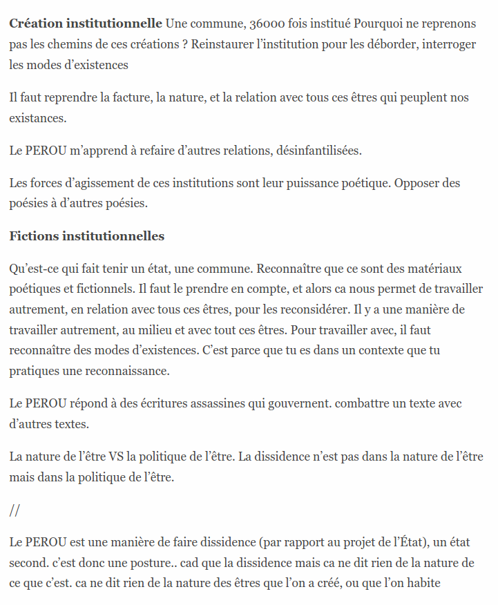

<!-- .element style="font-size:1em;width:35%;float:left;margin:0 1em 0 0" -->

> **Création institutionnelle** Une commune, 36000 fois institué Pourquoi ne reprenons pas les chemins de ces créations ? Reinstaurer l’institution pour les déborder, interroger les modes d’existences
>
> Les forces d’agissement de ces institutions sont leur puissance poétique. Opposer des poésies à d’autres poésies.
>
> **Fictions institutionnelles**
>
> Qu’est-ce qui fait tenir un état, une commune. Reconnaître que ce sont des matériaux poétiques et fictionnels. Il faut le prendre en compte, et alors ca nous permet de travailler autrement, en relation avec tous ces êtres, pour les reconsidérer.
>
> Le PEROU répond à des écritures assassines qui gouvernent. combattre un texte avec d’autres textes.

<!-- .element style="font-size:0.6em;width:60%;float:left;background-color:#222" -->

**Source : Notes d’atelier Sébastien Thiéry - Republier le monde**  
http://notes.ecrituresnumeriques.ca/3D2XP5bjRkuREiZlYW8vkQ.html

<!-- .element style="font-size:0.7em;color:#222" -->

§§§§§§§§§§§§§§§§§§§§§§§§§§§§§§§§§§§§§§§§§§§§§

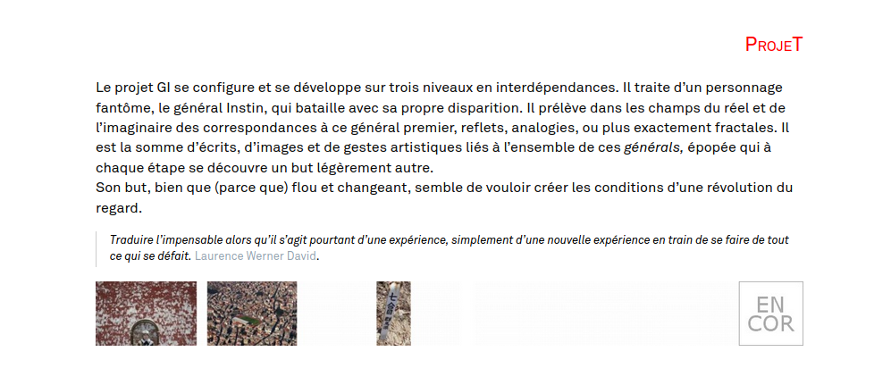

Source : lexique généraliste  
http://remue.net/lexique-generaliste

<!-- .element style="font-size:0.7em" -->

===
Je termine comme, c'est la coutume Servanne, par une citation du lexique généraliste :

«Le projet GI se configure et se développe sur trois niveaux en interdépendances. Il traite d’un personnage fantôme, le général Instin, qui bataille avec sa propre disparition. Il prélève dans les champs du réel et de l’imaginaire des correspondances à ce général premier, reflets, analogies, ou plus exactement fractales. Il est la somme d’écrits, d’images et de gestes artistiques liés à l’ensemble de ces générals, épopée qui à chaque étape se découvre un but légèrement autre.»

«Son but, bien que (parce que) flou et changeant, semble de vouloir créer les conditions d’une révolution du regard.»

%%%%%%%%%%%%%%%%%%%%%%%%%%%%%%%%%%%%%%%%%%%%%
<!-- .slide: data-background-image="img/iLoveInstin.jpg" data-background-size="contain" -->
<!-- .slide: class="hover"-->

### Merci !

&nbsp;

&nbsp;

 <!-- .element: class="logo" style="width:30%; background-color:ghostwhite;padding: 5px" -->

_Cartographie du web littéraire francophone_  
Université Lyon 3 - 22-24 janvier 2020

<!-- .element: style="font-size:1.4rem" -->

 <!-- .element: class="logo" -->
